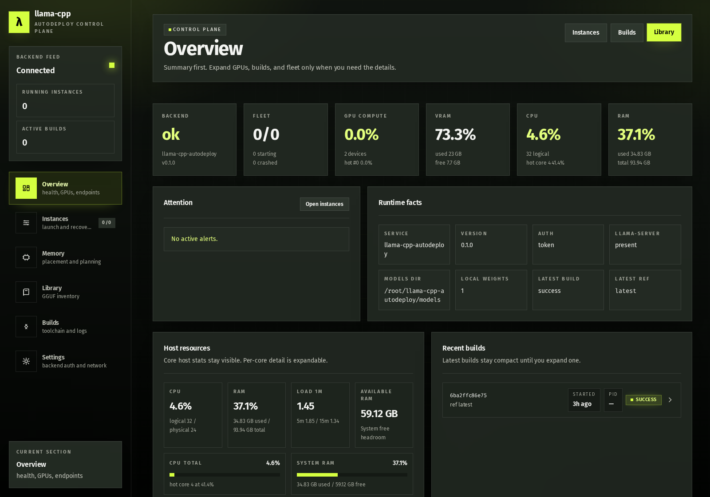
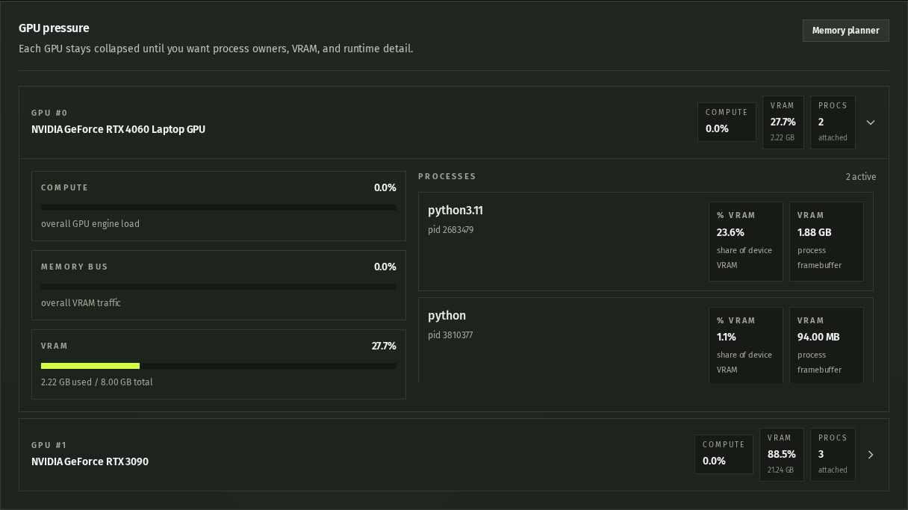
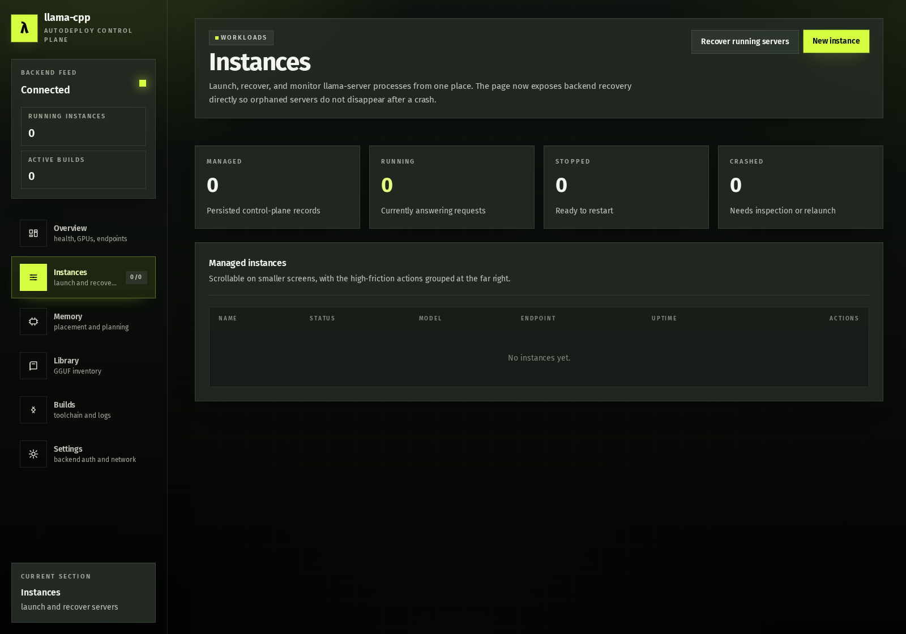
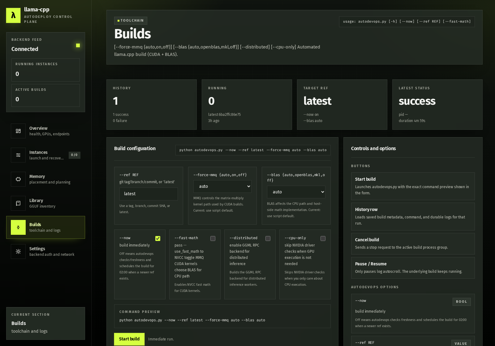
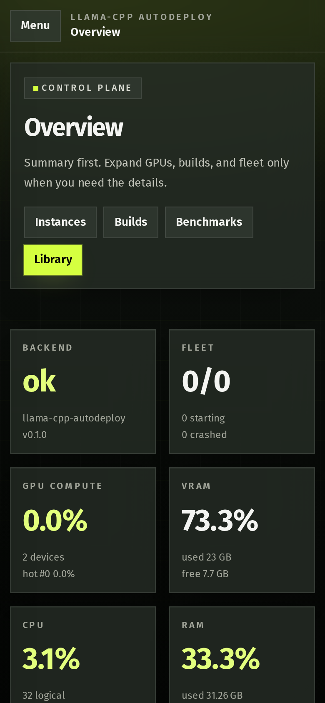
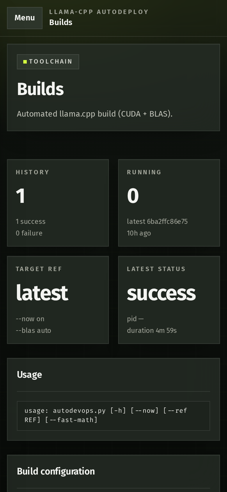

# llama-cpp-autodeploy

<p align="center">
  
  
  
  
  
</p>

<p align="center">
  Build <code>llama.cpp</code>, launch local inference services, and manage the stack from terminal or browser.
</p>

<p align="center">
  <a href="#quick-start">Quick Start</a> |
  <a href="#build-llamacpp">Build</a> |
  <a href="#launch-services">Launch</a> |
  <a href="#distributed-inference-rpc">Distributed</a> |
  <a href="#web-ui-browser-backend--frontend">Web UI</a> |
  <a href="#tests">Tests</a>
</p>

`llama-cpp-autodeploy` keeps the repo-local workflow in one place:
`autodevops.py` builds `llama.cpp`, `loadmodel.py` launches services, and
`web/` wraps the same flow in a browser control plane with auth, persisted
state, live logs, and orphaned-process recovery.

## What's included

| Surface | Entry points | Purpose |
| --- | --- | --- |
| Build | `autodevops.py`, `autodevops_cli.py` | Build repo-local `llama.cpp` with CUDA, MMQ, BLAS, and RPC options |
| Local inference | `loadmodel.py`, `loadmodel_cli.py` | Launch `llama-server` for chat or embedding workloads |
| Reranking | `loadmodel.py --rerank`, `reranker.py` | Run a Transformers reranker HTTP service |
| Distributed inference | `loadmodel_dist_cli.py`, `rpc_server_cli.py` | Manage `llama-cli` + `rpc-server` worker setups |
| Browser control plane | `web_cli.py`, `web/backend`, `web/frontend` | Build, launch, inspect logs, plan memory, recover instances |

## Requirements

- Linux with Python 3.10+ (tested here with Python 3.12).
- Build tools for `llama.cpp`: `git`, `cmake`, `make`, `gcc`, `g++`, `pkg-config`.
- NVIDIA drivers + CUDA toolkit if using CUDA builds/runtime.
- Optional BLAS libraries:
  - Intel MKL (for `--blas mkl`)
  - OpenBLAS (for `--blas openblas`)

Python dependencies are in `requirements.txt` (PyTorch CUDA 12.9 index + Transformers stack).

## Quick start

```bash
python3 -m venv venv
source venv/bin/activate
pip install -U pip
pip install -r requirements.txt
python autodevops.py --ref latest --now
python loadmodel.py --llm ./models/model.gguf --port 45540
python web_cli.py --init
python web_cli.py
```

Use the CLI/TUI paths below when you want a more guided flow.

## Build llama.cpp

### Interactive (recommended)

```bash
python autodevops_cli.py
```

> Note: this is a curses TUI and must run in a real terminal.

### Non-interactive

```bash
python autodevops.py --help
python autodevops.py --ref latest --now
```

Supported build flags:

| Flag | Meaning |
| --- | --- |
| `--ref <tag|branch|commit|latest>` | Build a specific upstream ref |
| `--now` | Build immediately instead of waiting for the scheduled path |
| `--fast-math` | Pass fast-math CUDA flags to NVCC |
| `--force-mmq {auto,on,off}` | Control MMQ CUDA kernels |
| `--blas {auto,openblas,mkl,off}` | Choose the CPU BLAS backend |
| `--distributed` | Build GGML RPC support |
| `--cpu-only` | Skip NVIDIA driver prechecks |

## Launch services

### Interactive launcher

```bash
python loadmodel_cli.py
```

### Unified CLI launcher (`loadmodel.py`)

`loadmodel.py` supports three mutually exclusive modes:

| Mode | Result |
| --- | --- |
| `--llm` | Start `./bin/llama-server` for completion/chat |
| `--embed` | Start `./bin/llama-server` for embeddings |
| `--rerank` | Start the Transformers reranker HTTP service |

```bash
python loadmodel.py --help
```

Examples:

```bash
# LLM (local GGUF)
python loadmodel.py --llm ./models/model.gguf --port 45540

# Embeddings (download GGUF from HF repo, auto-select quant/file)
python loadmodel.py --embed Qwen/Qwen3-Embedding-8B-GGUF:Q8_0 --port 45541

# Reranker HTTP server
python loadmodel.py --rerank Qwen/Qwen3-Reranker-8B --host 127.0.0.1 --port 45542
```

For MoE-capable `llama-server` builds, `loadmodel.py` also accepts:

- `--cpu-moe`
- `--n-cpu-moe <N>`

If the local `llama-server` binary does not expose these flags, `loadmodel.py` exits with a rebuild hint.

## Distributed inference (RPC)

### Interactive distributed launcher

```bash
python loadmodel_dist_cli.py
```

This TUI can:

- scan private subnets for RPC workers,
- manage worker host list,
- optionally start a local `rpc-server`,
- launch `llama-cli` with `--rpc` workers.

### Standalone rpc-server helper

```bash
python rpc_server_cli.py --help
python rpc_server_cli.py --host 0.0.0.0 --port 5515 --devices 0
```

`rpc_server_cli.py` requires `./bin/rpc-server` to exist (build with `--distributed` / distributed backend enabled).

## Web UI (browser backend + frontend)

A FastAPI backend plus a React + Vite + TypeScript frontend under [web/](web/)
turn the repo into a browser control plane. It wraps the same local helpers
already used by the CLI tools instead of inventing a separate runtime path.

| Layer | Role |
| --- | --- |
| `autodevops.py` | Build local `llama.cpp` binaries |
| `loadmodel.py` | Launch `llama-server` and reranker processes |
| `memory_utils.py` | Probe VRAM, RAM, and placement estimates |
| `web/backend/` | Auth, state, logs, recovery, and API surface |
| `web/frontend/` | Browser UI for overview, builds, instances, memory, and library |

### Backend

```bash
source venv/bin/activate
pip install -r requirements.txt          # adds fastapi, uvicorn, pydantic, websockets
python web_cli.py --init                 # writes .web_config.json with a fresh bearer token
python web_cli.py                        # serves on http://0.0.0.0:8787 by default
```

The backend binds to `0.0.0.0` by default and requires a bearer token on every
request except `GET /api/health`. Change `host`, `port`, and `models_dir` in
[.web_config.json](.web_config.json). Managed instances and builds persist in
`.web_state.json`, logs tee to `web/logs/<id>.log`, and the manager can
re-adopt orphaned repo-launched `llama-server` processes on startup or through
`POST /api/instances/recover`.

<details>
<summary>API surface</summary>

- Health: `GET /api/health`
- Memory: `GET /api/memory/gpus`, `POST /api/memory/plan`, `POST /api/memory/auto-split`
- Models: `GET /api/models/local`, `GET /api/models/binary-caps`, `POST /api/models/download`
- Instances: `GET /POST /api/instances`, `GET /api/instances/{id}`, `POST /api/instances/{id}/start|stop|restart`, `DELETE /api/instances/{id}`, `POST /api/instances/recover`, `WS /api/instances/{id}/logs?token=...`
- Builds: `GET /POST /api/builds`, `GET /api/builds/{id}`, `POST /api/builds/{id}/stop`, `WS /api/builds/{id}/logs?token=...`

Full schema: `GET /docs`
</details>

### Frontend

```bash
cd web/frontend
npm install
npm run dev        # http://localhost:5173, proxies /api -> http://127.0.0.1:8787
# or for production:
npm run build      # writes web/frontend/dist/
```

When `web/frontend/dist/` exists, `python web_cli.py` automatically mounts it
at `/` so the full app is served at `http://<host>:8787`. In the UI, open
**Settings** and paste the token printed by `python web_cli.py --init` (or
read it from `.web_config.json`).

| Page | Focus |
| --- | --- |
| **Dashboard** | Backend health, fleet status, host telemetry, GPU pressure, builds |
| **Instances** | Create, recover, start, stop, restart, and delete `llama-server` processes |
| **Instance logs** | Live WebSocket tail with pause/resume |
| **Memory** | Live GPU probe plus `estimate_memory_profile()` previews |
| **Library** | Scan `./models` and download GGUFs from Hugging Face |
| **Builds** | Trigger `autodevops.py`, inspect flags, preview commands, stream logs |
| **Settings** | Backend URL and bearer token |

Screenshots:

#### Dashboard Overview

Main control-plane view with backend health, fleet summary, and host telemetry.

<p align="center">
  
</p>

#### GPU Runtime Detail

Expandable GPU panel with compute pressure, VRAM usage, and process ownership.

<p align="center">
  
</p>

#### Instances

Launch and recover `llama-server` processes with the same knobs as the local launcher flow.

<p align="center">
  
</p>

#### Builds

Browser view for `autodevops.py`, including flags, command preview, and build history.

<p align="center">
  
</p>

#### Mobile Dashboard

Phone-sized overview with the shell, stats, and disclosures compressed cleanly.

<p align="center">
  
</p>

#### Mobile Builds

Build history and command controls on a narrow viewport without wasting the first screen.

<p align="center">
  
</p>

<details>
<summary>Refresh screenshot assets</summary>

```bash
cd web/frontend
npx playwright install chromium
WEB_BEARER_TOKEN="$(python - <<'PY'
import json
print(json.load(open('../../.web_config.json', 'r', encoding='utf-8'))['token'])
PY
)" npm run screenshots:readme
```
</details>

### Security notes

- The bearer token is the only auth layer; keep `.web_config.json` readable
  only by you and prefer binding to `127.0.0.1` when you don't need remote
  access.
- WebSocket endpoints accept the token as a `?token=` query parameter because
  browsers can't set `Authorization` headers on WS upgrade. If you expose the
  backend beyond a trusted LAN, put it behind an HTTPS reverse proxy.
- Managed `llama-server` processes inherit the backend's environment, so
  `HF_TOKEN`, `CUDA_VISIBLE_DEVICES`, `OMP_NUM_THREADS` and friends work the
  same as running `loadmodel.py` directly.

## Convenience launcher

`./start` uses `./venv/bin/python` and offers a small menu:

```bash
./start
./start autodevops
./start loadmodel
./start web [--init]
./start --help
```

## Tests

Run unit tests:

```bash
python -m unittest discover -s tests
```

Current tests cover:

- CUDA home resolution behavior in `autodevops.py`
- option/config assembly helpers in `autodevops_cli.py`

## Sample scripts

`run/` currently includes:

- `run_qwen30b_llm.sh`
- `run_qwen_embed8b.sh`
- `run_qwen_reranker8b.sh`

These are examples for fixed ports/model targets and can be adapted to your environment.
